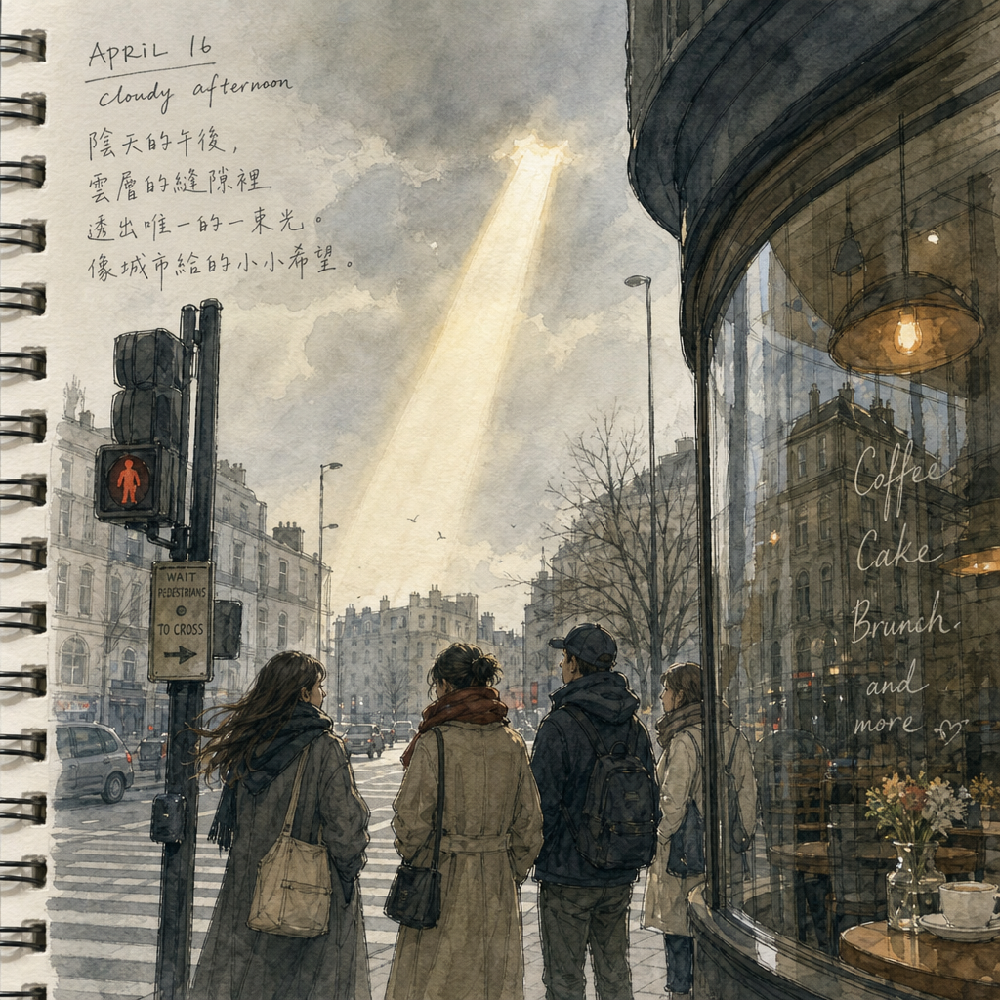

# 글로 쓰는 그림일기 - Picture Diary

일기 텍스트를 4장면 이미지 + 영상으로 변환하는 멀티 LLM 파이프라인

## 빠른 시작

```bash
uv venv && uv pip install -r requirements.txt
# .env에 아래 키 추가 후 실행
# OPENAI_API_KEY=your_key_here
# FAL_KEY=your_key_here
python pipeline.py
```

## 결과 미리보기



<video src="https://github.com/user-attachments/assets/a4ae2c70-ae12-4a3b-a5d8-9b8916099da1" controls width="480"></video>


## 운영 지표

`cost_report.md` 기준 5일 누적 비용

| Day            | 주요 작업                       | 모델         |      호출 수 |                      단가 |             합계 |
| -------------- | ------------------------------- | ------------ | -----------: | ------------------------: | ---------------: |
| Day 1          | 환경 확인과 첫 호출             | gpt-image-2  |            1 | $0.003 |           $0.003 |                  |
| Day 2          | 장면 JSON 생성 + fal.ai 첫 호출 | FLUX-schnell |            2 | $0.003 |           $0.006 |                  |
| Day 3          | 4장면 이미지 생성               | gpt-image-2  |            4 | $0.003 |           $0.012 |                  |
| Day 4          | 영상 생성 (Kling 비동기 폴링)   | Kling        |            2 | $0.050 |           $0.100 |                  |
| Day 5 self1    | 도메인 A/B 테스트 (travel)      | FLUX-schnell |            6 | $0.003 |           $0.018 |                  |
| **합계** |                                 |              | **15** |                           | **$0.139** |

> `total_cost_usd`: **$0.136** (ab_test_results.json 기준)

## A/B 테스트 요약

`ab_test_results.json` 기준

| 그룹 | seed | 호출 수 | P95 지연 |
| ---- | ---: | ------: | -------: |
| A    |   42 |       3 |  2.933초 |
| B    |  137 |       3 |  2.396초 |

* 도메인: `travel`
* `cost_per_image`: $0.003
* `p95_latency_s`: 2.933

## 도메인 응용

Day 5 self1에서 선택한 도메인: **travel**

`domains/travel_prompts.json` 기반 프롬프트 스타일

| 항목         | 값                                              |
| ------------ | ----------------------------------------------- |
| shot         | wide shot, landscape, establishing shot         |
| angle        | eye-level, low angle for drama                  |
| lighting     | golden hour, natural light, magic hour glow     |
| lens / style | 24mm wide lens, watercolor illustration style   |
| mood         | scenic, wanderlust, warm nostalgia, atmospheric |

사용 장면 예시 (scene_01):

> 해질 무렵 골목길을 걸었다. 오렌지빛 하늘 아래 낡은 건물들이 따뜻하게 빛났다.

## 파일 구조

```
picture-diary/
├── agents/
│   ├── image.py          # 이미지 생성 에이전트
│   ├── scene.py          # 장면 추출 에이전트
│   └── video.py          # 영상 생성 에이전트 (Kling)
├── domains/
│   ├── product_prompts.json
│   ├── emoji_prompts.json
│   └── travel_prompts.json
├── outputs/
│   └── 2026-05-26/
│       ├── scene_1.png ~ scene_4.png
│       └── scene_1.mp4
├── ab_test.py            # A/B 테스트 + P95 계산
├── main.py               # A/B 실행 + 리포트 저장
├── pipeline.py           # 전체 파이프라인 진입점
├── ab_test_results.json  # A/B 결과
├── cost_report.md        # 5일 누적 비용 리포트
├── diary.md              # 입력 일기 텍스트
├── scene_prompts.json    # 수동 작성 장면 프롬프트
├── scene_extracted.json  # GPT 자동 추출 장면 프롬프트
├── .env                  # API 키 (git 제외)
└── requirements.txt
```

### **GitHub URL**

`https://github.com/kimdahee0815/picture-diary`
